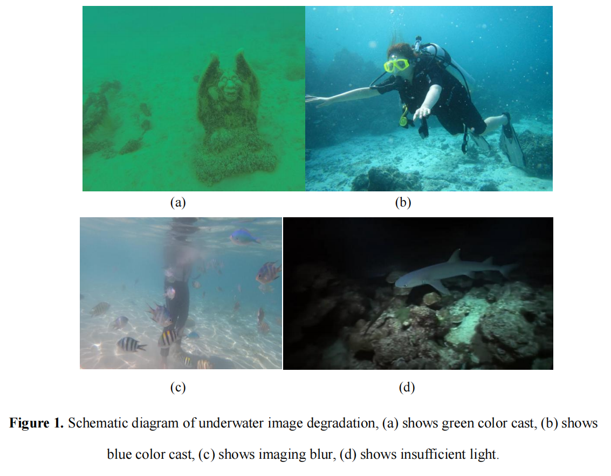
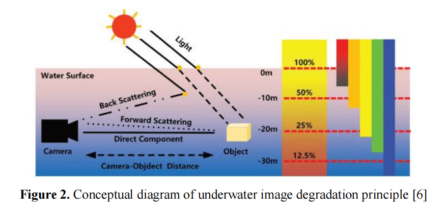
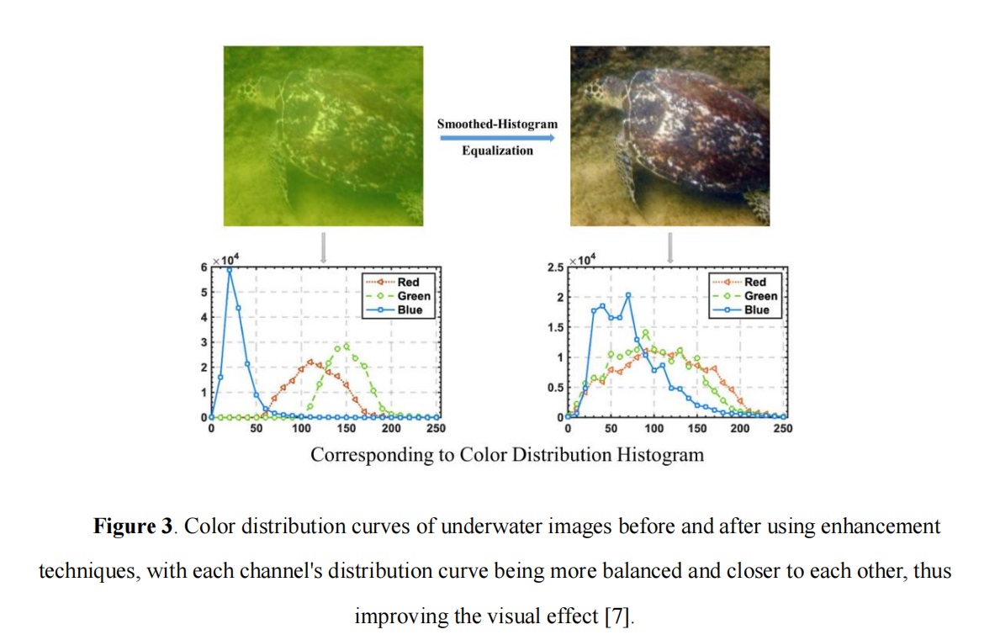

# APMCM-2024 Problem A

## Problem Statement

**Research on Underwater Image Enhancement in Complex Scenarios**

For ocean exploration, clear and high-quality underwater images are crucial for deep-sea
topography surveying and seabed resource investigation. However, in complex underwater
environments, the image quality deteriorates due to phenomena such as absorption and
scattering of light during its propagation in water, resulting in blurriness, low contrast, color distortion, etc. These conditions are referred to as underwater image degradation. The main causes of underwater image degradation include light propagation loss in
water, forward scattering and backward scattering effects, as well as the scattering effect
of suspended particles on light [5]. These factors collectively result in the loss of details and clarity during the transmission
process of underwater images, affecting visual recognition and analysis.

The schematic diagram of the underwater imaging process is shown in Figure 2. According to the Jaffe-McGlamery underwater imaging model, the underwater image
captured by the camera can be represented as a linear combination of three components:
direct component, forward scattering component, and backward scattering component
[1]. Among them, the forward scattering component refers to the light that enters the imaging
system after being scattered by suspended particles in water from target surface reflection or
radiation. This component will cause blurring in the obtained image. The backward scattering
component refers to the light that enters the imaging system after natural light entering water
is scattered by suspended particles, resulting in low contrast in the obtained image. In general
cases, due to close distance between objects and cameras, a simplified imaging model is used:

$$
I(x)=J(x)t(x)+B(t(x))
$$

where _I(x)_ represents the degraded underwater image, _J(x)_ represents the clear image, B is the
ambient light in the underwater environment, and _t(x)_ is the light transmission function of the
underwater scene. The light transmission rate varies under different conditions. At the same
time, the underwater ambient light also changes with factors such as depth and the turbidity of
the water, all of which can lead to increased degradation of underwater images.

Before performing enhancement and other processing operations on underwater images, it is 
necessary to conduct statistical analysis on the image to be processed, as shown in Figure 3. 
Image analysis generally utilizes mathematical models combined with image processing
techniques to analyze underlying features and higher-level structures, thereby extracting
intelligent information. For example, using a histogram can statistically analyze the
distribution of colors in different channels of the image, while applying edge operators can
provide clarity information about object contours in the image. These pieces of information
help us classify images into different categories and propose targeted solutions for image
enhancement.

Underwater image enhancement technology is a technique that improves the quality of
images captured in underwater environments by applying signal processing, image processing,
and machine learning theories. **It aims to reduce problems such as image blur, color
distortion, and decreased contrast caused by the absorption and scattering of light in
water, thereby improving the visibility and clarity of underwater images.** 

Underwater image enhancement and restoration methods can be divided into **traditional
methods and deep learning methods.** Traditional methods can be further categorized into
**non-physical models and physics-based models.** Non-physical model methods improve
visual quality by directly adjusting the pixel values of images, including **applying existing
image enhancement methods and specially designed algorithms**. Physics-based model
methods **model and estimate parameters to invert the degradation process of underwater
images.** These methods can invert based on assumptions or prior knowledge, or they can use
the optical properties of underwater imaging to improve the restored images. However, due to
the complexity of underwater scenes, most existing methods cannot handle all scenarios. Therefore, an underwater scene enhancement algorithm tailored for complex scenarios is very
important for subsequent tasks in underwater vision.

___

To estimate the degree of underwater image degradation in different scenarios and
provide targeted enhancement methods, please answer the following questions:

- **Question 1:** Please use image statistical analysis techniques similar to those mentioned
in the above text to perform multi-angle analysis on the underwater image provided in
Attachment 1. Classify the image provided in Attachment 1 into three categories: 
color cast, low light, and blur, and fill in the filenames in the three positions in the
"Answer.xls" attachment. Also, explain the reasons for such classification.

- **Question 2:** Based on the types of degradation proposed in Question 1, using the
underwater imaging model provided in the problem, construct an underwater scene image
degradation model with the images attached. Analyze the degradation reasons of underwater
images captured from different scenes [1] (including but not limited to color cast, 
low light, etc.). Analyze the similarities or differences of these degradation models 
(for example, categorize from perspectives such as color, lighting, clarity, etc.).

- **Question 3:** Based on the underwater scene image degradation model established in
Question 2, propose an underwater image enhancement method tailored for a single scene
(such as color cast, blur, low light), and validate the proposed enhancement method using the
image data provided in the attachment. Include the enhanced results of the test images
from Attachment 2 and their corresponding evaluation metrics in the paper, calculate
and present the PSNR, UCIQE, UIQM, and other evaluation metrics for the output
images, and fill them in the table Attachment 1 results provided in "Answer.xls".

- **Question 4:** The modeling adaptability of existing underwater image enhancement
models varies across different scenarios. Please, in conjunction with the above question and
the images provided in the attachment, propose an underwater image enhancement model
tailored for complex scenarios (e.g., a non-physical model, references [2]-[5] may be
consulted). This model should be capable of enhancing underwater image degradation issues
across a variety of complex scenes. Include the enhanced results of the test images from
attachment 2 and their corresponding evaluation metrics in the paper for display, calculate
and output the PSNR, UCIQE, UIQM, and other evaluation metrics of the output
image, and fill them in the table Attachment 2 results provided in "Answer.xls".

- Question 5: Compare various enhancement techniques for specific scenarios with a
single enhancement technique for complex scenarios, and propose feasibility suggestions for
underwater visual enhancement in practical applications.

### Attachment
Attachment: https://pan.baidu.com/s/1tXeoiDvxsGbIQ42obLf5xw?pwd=2024 code: 2024

### Appendix

#### **Underwater image evaluation metrics:**

PSNR (Peak Signal-to-Noise Ratio), UCIQE (Underwater Color Image Quality
Evaluation), and UIQM (Underwater Image Quality Measure) are crucial indicators used to
assess image quality. Below is a comprehensive description of the calculation methods for
these three metrics.

#### **PSNR (Peak Signal-to-Noise Ratio):**

PSNR is an objective standard for measuring image quality, which calculates the mean
square error (MSE) between the original image and the processed image, and converts it into
decibel units to measure image quality.

#### **UCIQE (Underwater Color Image Quality Evaluation):**

UCIQE [9] is a linear combination of color density, saturation, and contrast, used to
quantitatively evaluate the non-uniform color cast, blurriness, and low contrast in underwater
images. It is an image quality assessment metric that does not require a reference (ground
truth) image. The specific definition is as follows:

$$
\text{UCIQE} = c_1 \times \sigma_c + c_2 \times \text{con}_l + c_3 \times \mu_s
$$

Among them, $\sigma_c$ represents the chromaticity standard deviation, $\text{con}_l$ represents
brightness contrast, and $\mu_s$ represents average saturation. $ c_1$, $c_2$, and $c_3$ are weighting
coefficients. As mentioned above, there is a good correlatio between chromatic variance and
human perception for underwater color images of interest. Using chromatic differences to
describe color bias also has other reasons.

#### **UIQM (Underwater Image Quality Measure):**

UIQM [8] is an evaluation index that comprehensively considers attributes such as
colorfulness, sharpness, and contrast of underwater images. The calculation formula is:

$$
UIQM = \text{UIQM} = c_1 \times \text{UICM} + c_2 \times \text{UISM} + c_3 \times \text{UIConM}
$$

where UICM, UISM, and UIConM represent the measurements of colorfulness, 
sharpness, and contrast of underwater images respectively. 
 $ c_1$, $c_2$, and $c_3$ are the weighting coefficients.

### References
- [1]. Cong Runmin, Zhang Yumo, Zhang Chen, Li Chongyi, Zhao Yao. **Research Progress
of Deep Learning Driven Underwater Image Enhancement and Restoration**[J]. JOURNAL OF
SIGNAL PROCESSING, 2020, 36(9): 1377-1389. DOI:
10.16798/j.issn.1003-0530.2020.09.001
- [2]. Li C, Anwar S, Porikli F. **Underwater scene prior inspired deep underwater image
and video enhancement**[J]. Pattern Recognition, 2020, 98: 107038.
- [3]. Ancuti C O, Ancuti C, De Vleeschouwer C, et al. **Color balance and fusion for
underwater image enhancement**[J]. IEEE Transactions on image processing, 2017, 27(1):
379-393. 
- [4]. Wang Yongxin, Diao Ming, Han Chuang. **Underwater Image Restoration Algorithm
Based on Least Squares Estimation**[J]. Journal of Computer-Aided Design & Computer
Graphics, 2018, 30(11): 2125-2133. DOI: 10.3724/SP.J.1089.2018.17041
- [5]. Gao, X.; Jin, J.; Lin, F.; Huang, H.; Yang, J.; Xie, Y.; Zhang, B. **Enhancing
Underwater Images through Multi-Frequency Detail Optimization and Adaptive Color
Correction.** J. Mar. Sci. Eng. 2024, 12, 1790. https://doi.org/10.3390/jmse12101790
- [6]. Zhou J, Li B, Zhang D, et al. **UGIF-Net: An efficient fully guided information flow
network for underwater image enhancement**[J]. IEEE Transactions on Geoscience and
Remote Sensing, 2023. 
- [7]. Chen R, Cai Z, Yuan J. **UIESC: An underwater image enhancement framework via
self-attention and contrastive learning**[J]. IEEE Transactions on Industrial Informatics, 2023, 19(12): 11701-11711. 
- [8]. K. Panetta, C. Gao and S. Agaian, **"Human-Visual-System-Inspired Underwater
Image Quality Measures,"** in IEEE Journal of Oceanic Engineering, vol. 41, no. 3, pp. 541-551, July 2016, doi: 10.1109/JOE.2015.2469915
- [9]. M. Yang and A. Sowmya, **"An Underwater Color Image Quality Evaluation Metric,"**
in IEEE Transactions on Image Processing, vol. 24, no. 12, pp. 6062-6071, Dec. 2015, doi:
10.1109/TIP.2015.2491020.

