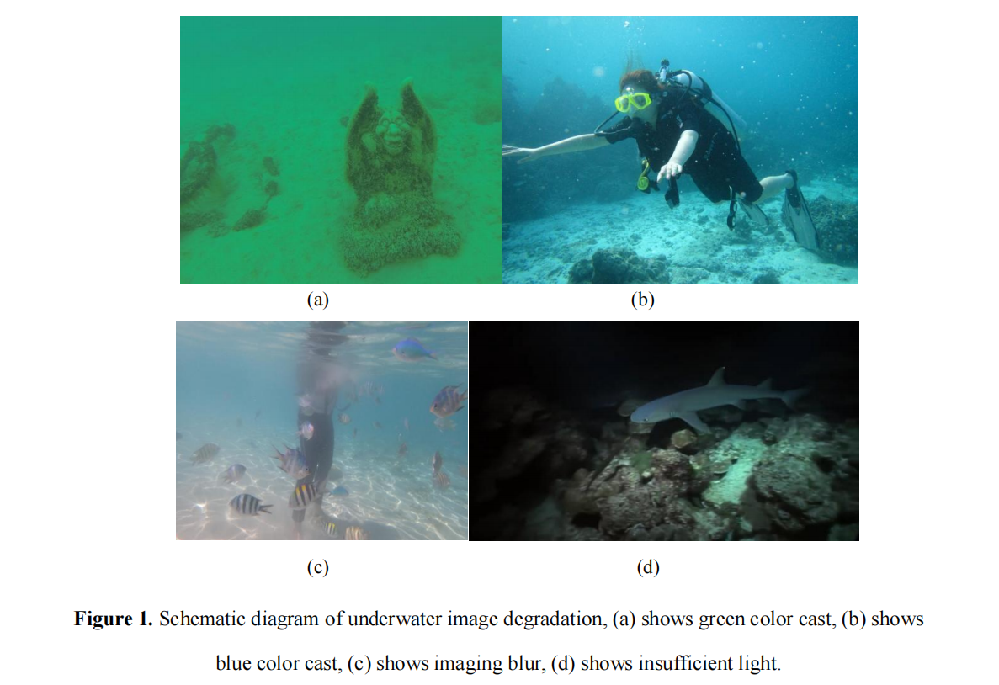

### 2024亚太地区数学建模竞赛  
#### 问题A  
**复杂场景下水下图像增强研究**

在海洋探索中，清晰且高质量的水下图像对深海地形勘测和海底资源调查至关重要。然而，在复杂的水下环境中，由于光在水中的传播会发生吸收和散射现象，图像质量会出现模糊、对比度低、色彩失真等问题。这些现象统称为水下图像退化。水下图像退化的主要原因包括水中光传播损失、前向散射和后向散射效应，以及悬浮颗粒对光的散射效应【5】。

这些因素共同导致水下图像在传输过程中细节和清晰度的丧失，影响视觉识别和分析。

（图1示例：展示绿色色偏、蓝色色偏、成像模糊和光线不足等退化效果）

水下成像过程的示意图如图2所示。根据Jaffe-McGlamery水下成像模型，水下图像可以表示为三个组成部分的线性组合：直接成分、前向散射成分和后向散射成分【1】。其中，前向散射成分指目标表面反射或辐射的光经水中悬浮颗粒散射后进入成像系统，这会导致获取的图像模糊。后向散射成分则指自然光进入水中后经悬浮颗粒散射后进入成像系统，导致获取的图像对比度降低。在一般情况下，由于物体和摄像头之间距离较近，可采用简化的成像模型：
$$
\begin{align*}
I(x) = J(x)t(x) + B(1-t(x))
\end{align*}
$$
其中，\(I(x)\) 表示退化后的水下图像，\(J(x)\) 表示清晰图像，\(B\) 为水下环境的背景光，\(t(x)\) 是水下场景的光透射函数。光的透射率在不同条件下会有所变化。同时，水下背景光也会因深度和水的浑浊度等因素而变化，这些都会加剧水下图像的退化。

（图2：水下图像退化原理的概念示意图）

在对水下图像进行增强和其他处理操作之前，需对待处理图像进行统计分析，如图3所示。图像分析通常结合数学模型与图像处理技术，以分析底层特征和高层结构，从而提取智能信息。例如，使用直方图可以统计分析图像中不同通道的颜色分布，而使用边缘算子可以提供物体轮廓的清晰度信息。这些信息帮助我们将图像分为不同类别，并提出针对性的图像增强解决方案。

**水下图像增强技术**  
水下图像增强技术是一种通过应用信号处理、图像处理和机器学习理论，改善水下环境中捕获图像质量的技术。其目标是减少因光在水中传播时发生吸收和散射而导致的图像模糊、色彩失真和对比度降低等问题，从而提高水下图像的可见性和清晰度。

水下图像的增强和恢复方法可分为传统方法和深度学习方法。传统方法又可分为非物理模型和基于物理的模型。  
- **非物理模型方法**：通过直接调整图像像素值改善视觉质量，包括应用现有的图像增强方法和专门设计的算法。  
- **基于物理的模型方法**：通过建模和参数估计，逆向推导水下图像的退化过程。这些方法可以基于假设或先验知识进行逆向操作，也可以利用水下成像的光学特性来改善还原后的图像。

然而，由于水下场景的复杂性，大多数现有方法无法应对所有场景。因此，针对复杂场景的水下图像增强算法对后续的水下视觉任务尤为重要。

___

为了评估不同场景下水下图像的退化程度，并提供针对性的增强方法，请回答以下问题：

**问题1**：  
请使用上述提到的图像统计分析技术，从多个角度对附件1中的水下图像进行分析。将附件1中的图像按以下三类进行分类：色偏、光线不足和模糊，并将文件名填写至“Answer.xls”附件中的相应位置。同时，解释分类的依据。

**问题2**：  
根据问题1中提出的退化类型，结合问题中提供的水下成像模型，构建与附件图像对应的水下场景图像退化模型。分析不同场景下水下图像退化的原因【1】（包括但不限于色偏、光线不足等）。从颜色、光照、清晰度等角度分析这些退化模型的异同点。

**问题3**：  
基于问题2中建立的水下场景图像退化模型，提出针对单一场景（如色偏、模糊或光线不足）设计的水下图像增强方法，并使用附件2提供的图像数据验证所提出的增强方法。在论文中包含测试图像的增强结果及其对应的评价指标，计算并呈现输出图像的PSNR、UCIQE、UIQM等评价指标，并将结果填写至“Answer.xls”附件的表格中。

**问题4**：  
现有水下图像增强模型在不同场景中的适应性存在差异。结合上述问题和提供的附件图像，提出一个针对复杂场景的水下图像增强模型（如非物理模型，可参考文献【2】-【5】）。该模型应能够处理多种复杂场景下的水下图像退化问题。在论文中包含测试图像的增强结果及其对应的评价指标，计算并输出增强后图像的PSNR、UCIQE、UIQM等评价指标，并将结果填写至“Answer.xls”附件的表格中。

**问题5**：  
比较针对特定场景的单一增强技术与针对复杂场景的综合增强技术，提出水下视觉增强在实际应用中的可行性建议。

**附件说明：**

- **附件链接**：  
  [百度网盘链接1](https://pan.baidu.com/s/1tXeoiDvxsGbIQ42obLf5xw?pwd=2024)（提取码：2024）  
  [百度网盘链接2](https://pan.baidu.com/s/1uPjARbudi2JSLQ80tr6JnQ?pwd=1cvc)（提取码：1cvc）

**附录：**

**水下图像评价指标**  
以下是三个用于评估图像质量的重要指标的综合说明及其计算方法：  

1. **PSNR（峰值信噪比，Peak Signal-to-Noise Ratio）**  
   PSNR是一种衡量图像质量的客观标准，它通过计算原始图像与处理后图像之间的均方误差（MSE），并转换为分贝单位来评价图像质量。

2. **UCIQE（水下颜色图像质量评估，Underwater Color Image Quality Evaluation）**  
   UCIQE【9】是一个基于颜色密度、饱和度和对比度的线性组合，用于定量评估水下图像中不均匀的色偏、模糊和低对比度等问题。这是一种无需参考图像（即无“地面真实值”）的图像质量评估指标，其定义如下：  
   $$
   UCIQE = c_1 \cdot \sigma_c + c_2 \cdot \text{Con}_l + c_3 \cdot \mu_s
   $$
   其中：  
   
   - σc 表示色度标准差，Conl 表示亮度对比度，μs 表示平均饱和度，c1,c2,c3 为权重系数。
   - 色差与人类对水下颜色图像的感知有较高相关性，因此用色差来描述色偏具有一定合理性。
   
3. **UIQM（水下图像质量评估，Underwater Image Quality Measure）**  
   UIQM【8】是一种综合考虑颜色丰富度、清晰度和对比度的水下图像评价指标，其计算公式为： 
   $$
   UIQM = c_1 \cdot \text{UICM} + c_2 \cdot \text{UISM} + c_3 \cdot \text{UIConM},
   $$
   其中：  

   - UICM 表示颜色丰富度，
   - UISM 表示清晰度，
   - UIConM 表示对比度，
   - c1,c2,c3 为权重系数。

## **References:**

[1]. Cong Runmin, Zhang Yumo, Zhang Chen, Li Chongyi, Zhao Yao. Research Progress

of Deep Learning Driven Underwater Image Enhancement and Restoration[J]. JOURNAL OF

SIGNAL 

PROCESSING, 

2020, 

36(9): 

1377-1389. 

DOI:

10.16798/j.issn.1003-0530.2020.09.001

[2]. Li C, Anwar S, Porikli F. Underwater scene prior inspired deep underwater image

and video enhancement[J]. Pattern Recognition, 2020, 98: 107038. 

[3]. Ancuti C O, Ancuti C, De Vleeschouwer C, et al. Color balance and fusion for

underwater image enhancement[J]. IEEE Transactions on image processing, 2017, 27(1):

379-393. 

[4]. Wang Yongxin, Diao Ming, Han Chuang. Underwater Image Restoration Algorithm

Based on Least Squares Estimation[J]. Journal of Computer-Aided Design & Computer

Graphics, 2018, 30(11): 2125-2133. DOI: 10.3724/SP.J.1089.2018.17041

[5]. Gao, X.; Jin, J.; Lin, F.; Huang, H.; Yang, J.; Xie, Y.; Zhang, B. Enhancing

Underwater Images through Multi-Frequency Detail Optimization and Adaptive Color

Correction. J. Mar. Sci. Eng. 2024, 12, 1790. https://doi.org/10.3390/jmse12101790

[6]. Zhou J, Li B, Zhang D, et al. UGIF-Net: An efficient fully guided information flow

network for underwater image enhancement[J]. IEEE Transactions on Geoscience and

Remote Sensing, 2023. 

[7]. Chen R, Cai Z, Yuan J. UIESC: An underwater image enhancement framework via

self-attention and contrastive learning[J]. IEEE Transactions on Industrial Informatics, 2023, 

19(12): 11701-11711. 

[8]. K. Panetta, C. Gao and S. Agaian, "Human-Visual-System-Inspired Underwater

Image Quality Measures," in IEEE Journal of Oceanic Engineering, vol. 41, no. 3, pp. 

541-551, July 2016, doi: 10.1109/JOE.2015.2469915

[9]. M. Yang and A. Sowmya, "An Underwater Color Image Quality Evaluation Metric,"

in IEEE Transactions on Image Processing, vol. 24, no. 12, pp. 6062-6071, Dec. 2015, doi:

10.1109/TIP.2015.2491020.